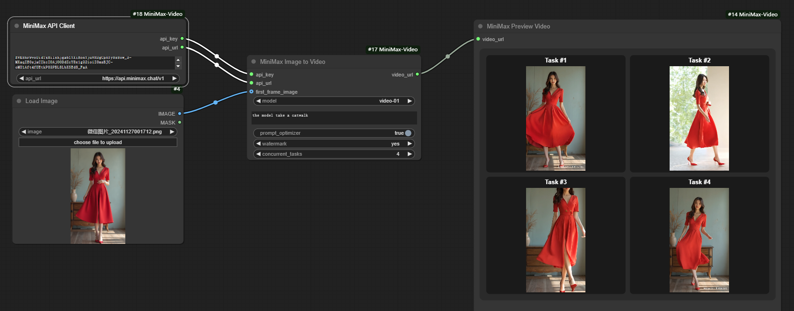

# ComfyUI MiniMax Video Extension

[English](#english) | [中文](#中文)

# English

## Overview
A ComfyUI extension that integrates MiniMax AI's image-to-video and text-to-video generation capabilities, allowing users to easily convert static images into dynamic videos.



## Features
- Image to video conversion
- Text to video conversion
- Support for multiple video generation models
- Real-time video preview
- Custom prompt optimization
- Flexible API configuration

## Installation

1. Clone this repository to your ComfyUI custom_nodes directory:
```bash
cd custom_nodes
git clone https://github.com/backearth1/ComfyUI-MiniMax-Video.git
```

2. Install required dependencies:
```bash
pip install -r requirements.txt
```


## Node Parameters

### MiniMax API Client Node
| Parameter | Description | Type | Default |
|-----------|-------------|------|---------|
| api_key | MiniMax API Key | STRING | - |
| api_url | API Base URL | ["https://api.minimax.chat/v1"] | "https://api.minimax.chat/v1" |

https://api.minimax.chat/v1 for users in China；
https://api.minimaxi.chat/v1 for users in other countries

### Image  or Text to Video Node
| Parameter | Description | Type | Default |
|-----------|-------------|------|---------|
| client | MiniMax API Client | MINIMAX_CLIENT | - |
| image | Input Image | IMAGE | - |
| prompt | Generation Prompt | STRING | "" |
| model | Video Model | ["video-01", "video-01-live2d"] | "video-01" |
| prompt_optimizer | Enable Prompt Optimization | BOOLEAN | true |


## Tips
1. Ensure you have a valid MiniMax API key
2. Video generation may take some time
3. Generated videos are saved in ComfyUI's output directory
4. Video files are named as "time+trace_id"
5. Use clear frontal images for best results
6. if you don't add any image, the node will support text to video
7. if you want to add watermark, please check "Add Watermark" option in the node parameters
8. if you open concurrent requests, please pay attention to the account configured with enough RPM

## Troubleshooting

**Q: Why did video generation fail?**
A: Check:
- API key validity
- Network connection
- Input image requirements
- Prompt appropriateness

**Q: How to get the best results?**
A: Recommendations:
- Use clear frontal images
- Write clear and specific prompts
- Choose appropriate models

---

# 中文

## 概述
ComfyUI MiniMax Video 扩展集成了 MiniMax AI 的图像转视频和文本转视频生成功能，让用户能够轻松地将静态图像转换为动态视频。


## 功能特点
- 图片转视频
- 文本转视频
- 支持多种视频生成模型
- 实时视频预览
- 自定义提示词优化
- 灵活的 API 配置

## 安装方法

1. 克隆仓库到 ComfyUI 的 custom_nodes 目录：
```bash
cd custom_nodes
git clone https://github.com/backearth1/ComfyUI-MiniMax-Video.git
```

2. 安装依赖：
```bash
pip install -r requirements.txt
```


## 节点参数说明

### MiniMax API 客户端节点
| 参数 | 说明 | 类型 | 默认值 |
|------|------|------|--------|
| api_key | MiniMax API 密钥 | STRING | - |
| api_url | API 基础地址 | ["https://api.minimax.chat/v1"] | "https://api.minimax.chat/v1" |

中国用户 https://api.minimax.chat/v1 ；
其他地区用户 https://api.minimaxi.chat/v1 

### 图像转视频节点
| 参数 | 说明 | 类型 | 默认值 |
|------|------|------|--------|
| client | MiniMax API 客户端 | MINIMAX_CLIENT | - |
| image | 输入图片 | IMAGE | - |
| prompt | 生成提示词 | STRING | "" |
| model | 视频模型 | ["video-01", "video-01-live2d"] | "video-01" |
| prompt_optimizer | 启用提示词优化 | BOOLEAN | true |

## 使用提示
1. 确保拥有有效的 MiniMax API 密钥
2. 视频生成可能需要一定时间
3. 生成的视频会保存在 ComfyUI 的输出目录中
4. 视频文件会以“时间+trace_id"命名
5. 建议使用清晰的正面图片以获得最佳效果
6. 如果未添加任何图片，节点将支持文本转视频
7. 如果需要添加水印，请在节点参数中勾选“添加水印”选项
8. 如果开启并发请求，请注意账号配置了足够的RPM

## 常见问题

**Q: 为什么视频生成失败？**
A: 请检查：
- API 密钥是否有效
- 网络连接是否正常
- 输入图片是否符合要求
- 提示词是否合适

**Q: 如何获得最佳效果？**
A: 建议：
- 使用清晰的正面图片
- 编写清晰具体的提示词
- 选择合适的模型

## License
MIT License

## 贡献
欢迎提交 Issues 和 Pull Requests！